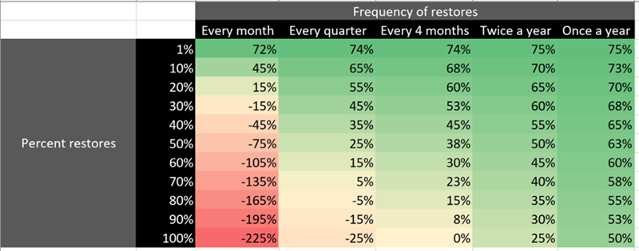
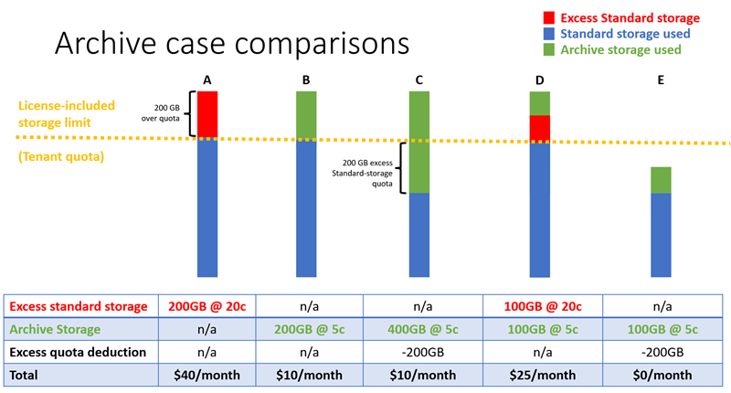

# Pricing model for Microsoft 365 Archive

Microsoft 365 Archive charges you for storage and reactivation.

- **Storage consumption** that is charged at a per-GB monthly rate. This meter is charged only when archived storage plus active storage in SharePoint exceeds the included or licensed allocated SharePoint storage capacity limit of the tenant. In other words, there's no additional storage cost for archived sites if the tenant hasn't yet consumed its already licensed Storage quota. For more information about storage capacity limits, see [SharePoint limits](/office365/servicedescriptions/sharepoint-online-service-description/sharepoint-online-limits).

- **Site reactivation** that is charged at a per-GB rate. The reactivation fee is charged regardless of whether a tenant is above or below its SharePoint capacity limit and only if reactivation is executed more than seven days after the site was most recently put into an archive state. This seven-day grace period provides you with the opportunity to reverse an accidental archival without reaction costs.  

Monthly archive usage is calculated as the sum of the usage of all currently archived sites. Each site’s usage is equal to the site storage usage of that site, which can be seen on the site itself or from the Active sites page in the SharePoint admin center. The size of an archived site, and therefore the storage for which it's billed, can only change if the content in the site changes (for example, content naturally expiring in the recycle bin or a retention policy deleting content within the site directly from archive to the recycle bin).

To see the pricing for Microsoft 365 Archive, see [Pay-as-you-go services and pricing for Microsoft Syntex](/microsoft-365/syntex/syntex-pay-as-you-go-services).

## Pricing calculator

The Microsoft 365 Archive pricing calculator is a tool that helps you estimate the costs that you incur to archive your Microsoft 365 data.

> [!NOTE]
> The tool is not intended to provide an exact prediction of your archive costs, but rather to give you an estimate based estimated usage data provided by you.

### Pricing calculator overview

The Microsoft 365 Archive pricing calculator, when calculating the potential costs and savings for using Microsoft 365 Archive, takes into consideration the following heuristics:

- The active tenant storage quota, measured in terabytes (TB)

- The active storage i.e. volume of standard storage currently in use, in terabytes (TB)

- The average archive storage expected to be consumed annually, in terabytes (TB)

- The percentage of archived content expected to be reactivated annually, in percentage (%)

- The annual frequency of reactivations for expected percentage reactivation, expressed as a count (number of times per year)

- The storage, archive and reactivation costs per gigabyte/per gigabyte per month, as applicable

### Using the pricing calculator

To use the Microsoft 365 Archive pricing calculator, you need to perform the following steps. Information about how to collect data from each of these steps is detailed later in this article.

1. Download the latest version of the [Microsoft 365 Archive pricing calculator tool](https://aka.ms/Microsoft365ArchiveCostCalculator).

2. Launch the tool and provide inputs in the cells indicated in the 'Input' column.

3. Observe the estimated results in the 'Results' column.

4. Modify the inputs in the 'Input' column if you wish to model a range of scenarios across input variables.

### Pricing calculator notes

When using the Microsoft 365 Archive pricing calculator, be aware of the following points:

- In the Microsoft 365 Archive pricing calculator, any Excel spreadsheet cell that is colored orange can have data entered.

### Cost savings using Microsoft 365 Archive

The following table helps visualize the savings you'll realize by archiving content based on the frequency and percent of all archived content you're restoring. The key takeaway is that if you are not reactivating more than 30% of your data more than twice a year, you'll achieve most of the savings offered by the product.

## Billing scenarios

Your charges for Microsoft 365 Archive depend on your tenant’s Standard storage quota. The following scenarios and diagram can help you compare charges based on excess storage.

|Scenario  |Description  |Additional costs  |
|---------|---------|---------|
|**A**     |Tenant has not archived any data and exceeds the Standard storage quota by 200 GB.         |Purchase 200 GB of additional Standard storage packs.         |
|**B**     |Tenant has archived the 200 GB of data that exceeded their Standard storage quota.         |200 GB of Archive storage charged at $0.05/GB/month.         |
|**C**     |Tenant has archived more storage than exceeded their Standard storage quota.         |Only charged for the 200 GB of Archived data that exceeds their Standard storage quota.         |
|**D**     |Tenant has archived some, but not all, of the data that exceeds their Standard storage quota.         |Purchase additional Standard storage packs and pay $0.05/GB/month for ~100 GB of Archived data.         |
|**E**     |Tenant’s total data (Standard + Archive) is less than their Standard storage quota.         |No additional costs.         |

