# Create, view, and edit backup policies in Microsoft 365 Backup

## Create backup policies

To use Microsoft 365 Backup for OneDrive, SharePoint, or Exchange, you need to create a backup policy for each product. A *policy* represents the backup plan defined by admins for protecting the Microsoft 365 data of an organization.

A policy contains details of what data (OneDrive accounts, SharePoint sites, and Exchange mailboxes) to protect. Although you see the retention period and backup frequency (which defines the restore point objective), those settings aren't currently variable or modifiable.

Select the **OneDrive**, **SharePoint**, or **Exchange** tab for steps to create a backup policy for that product.

# [OneDrive](#tab/onedrive)

Follow these steps to set up a backup policy for OneDrive accounts using Microsoft 365 Backup.

1. Go to the [Microsoft 365 admin center](https://admin.microsoft.com/Adminportal/Home).

2. Select **Settings**.

3. Select **Microsoft 365 Backup** from the list of products.

4. On the **Microsoft 365 Backup** page, in the **OneDrive** section, select **Set up policy**.

    

5. On the **Overview** page, review the backup features for OneDrive, and then select **Next**.

    

6. On the **Choose selection method** page, you can set up OneDrive user accounts using any or all three ways. A protection scope is the scope of user accounts within OneDrive that you want to protect with Microsoft 365 Backup.

    

    a. Under **Upload a list of accounts in a CSV file**, you can upload a list of accounts to backup via a CSV file.

    The CSV upload feature for bulk addition of sites or user accounts in the backup policy creation workflow can accommodate a maximum of 50,000 entries per CSV file.

    b. Under **Back up accounts that match specific filters**, you can select **Distribution lists** or **Security groups**, or both. The distribution list and security group are flattened when added, meaning the policy won't update dynamically if the groups or distribution list are updated later.

    The rule-based feature for bulk addition of user accounts via security groups or distribution lists can accommodate a maximum of three groups at a time. These rules are static and applied one time only. That is, the security groups or distribution lists are flattened at the time of adding to the backup configuration policy. For example. groups or list won't be dynamically updated in the system if users are added or removed from the original security group.

    > [!NOTE]
    > The site last modified feature is in preview.

    c. Under **Select accounts individually**, you can search and select accounts you want to add to a backup policy.

<!---
6. On the **Protection scope** page, you can set up OneDrive user accounts using any or all three ways. A protection scope is the scope of user accounts within OneDrive that you want to protect with Microsoft 365 Backup.

    

    a. Under **Add via search**, select **Choose accounts** to see user accounts that can be added via search. On the **Search and select accounts** panel, select the accounts you want to add to the policy.

    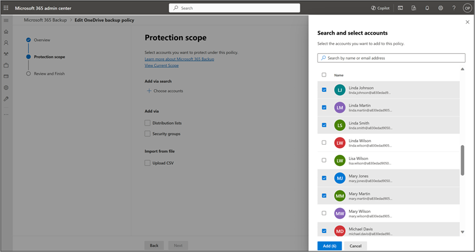

    b. Under **Add via**, select **Distribution lists** or **Security groups**, or both. The distribution list and security group are flattened when added, meaning the policy won't update dynamically if the groups or distribution list are updated later.

    

    The rule-based feature for bulk addition of sites via site names or URL in the backup policy creation workflow can accommodate a maximum of 10 keywords at a time. Each keyword can have a minimum of three characters and maximum of 255 characters.

    The rule-based feature for bulk addition of user accounts via security groups or distribution lists can accommodate a maximum of three groups at a time. These rules are static and applied one time only. That is, the security groups or distribution lists are flattened at the time of adding to the backup configuration policy. For example. groups or list won't be dynamically updated in the system if users are added or removed from the original security group.

    > [!NOTE]
    > The site last modified feature is in preview.

    c. Under **Import from file**, select **Upload CSV** to import user account details via CSV upload.

    

    The CSV upload feature for bulk addition of sites or user accounts in the backup policy creation workflow can accommodate a maximum of 50,000 entries per CSV file.
--->
7. Once you've made the right selections, select **Next** to create the backup policy for OneDrive.

8. On the **Review OneDrive backup policy** page, review the information to make sure it's how you want it, and then select **Create policy** (or **Update policy** if it's an update).

9. The backup policy for OneDrive is created.

    

    Once the sites are added to a backup policy, it might take up to 15 minutes per 1,000 sites for restore points to become available for restore.

# [SharePoint](#tab/sharepoint)

Follow these steps to set up a backup policy for SharePoint sites using Microsoft 365 Backup.

1. Go to the [Microsoft 365 admin center](https://admin.microsoft.com/Adminportal/Home).

2. Select **Settings**.

3. Select **Microsoft 365 Backup** from the list of products.

4. On the **Microsoft 365 Backup** page, in the **SharePoint** section, select **Set up policy**.

    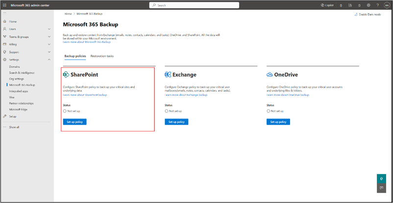

5. On the **Overview** page, review the backup features for SharePoint, and then select **Next**.

    

6. On the **Choose selection method** page, you can set up SharePoint sites using any or all three ways. A protection scope is the scope of user accounts within OneDrive that you want to protect with Microsoft 365 Backup.

    

    a. Under **Upload a list of sites in a CSV file**, you can upload a list of accounts to backup via a CSV file.

    The CSV upload feature for bulk addition of sites or user accounts in the backup policy creation workflow can accommodate a maximum of 50,000 entries per CSV file.

    b. Under **Back up sites that match specific filters**, you can select **Site name or URL contains** or **Site last modified**, or both.

    The rule-based feature for bulk addition of sites via site names or URL in the backup policy creation workflow can accommodate a maximum of 10 keywords at a time. Each keyword can have a minimum of three characters and maximum of 255 characters.

    > [!NOTE]
    > The site last modified feature is in preview.

    c. Under **Select sites individually**, you can search and select sites you want to add to a backup policy.

<!---
6. On the **Protection scope** page, you can set up SharePoint sites by choosing to back up individual sites or collection of sites. A protection scope is the scope of sites within SharePoint that you want to protect with Microsoft 365 Backup.

    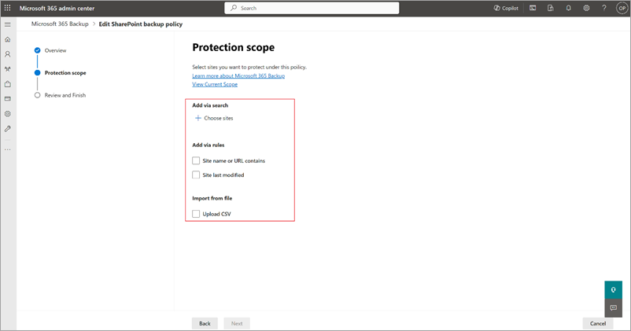

    a. Under **Add via search**, select **Choose sites** to see the individual sites or site collections that can be added via search. On the **Search and select sites** panel, select the sites you want to add to the policy.

    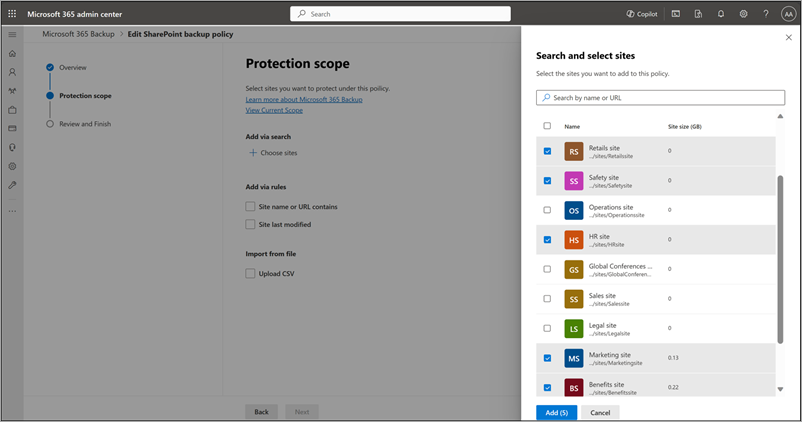

    b. Under **Add via**, select **Distribution lists** or **Security groups**, or both. The distribution list and security group are flattened when added, meaning the policy won't update dynamically if the groups or distribution list are updated later.

    The rule-based feature for bulk addition of sites via site names or URL in the backup policy creation workflow can accommodate a maximum of 10 keywords at a time. Each keyword can have a minimum of three characters and maximum of 255 characters.

    The rule-based feature for bulk addition of user accounts via security groups or distribution lists can accommodate a maximum of three groups at a time. These rules are static and applied one time only. That is, the security groups or distribution lists are flattened at the time of adding to the backup configuration policy. For example. groups or list won't be dynamically updated in the system if users are added or removed from the original security group.

    > [!NOTE]
    > The site last modified feature is in preview.

    c. Under **Import from file**, select **Upload CSV** to import user account details via CSV upload.

    

    The CSV upload feature for bulk addition of sites or user accounts in the backup policy creation workflow can accommodate a maximum of 50,000 entries per CSV file.
--->
7. Once you've made the right selections, select **Next** to create the backup policy for SharePoint.

8. On the **Review SharePoint backup policy** page, review the information to make sure it's how you want it, and then select **Create policy** (or **Update policy** if it's an update).

    

9. The backup policy for SharePoint is created.

    

    Once the sites are added to a backup policy, it might take up to 15 minutes per 1,000 sites for restore points to become available for restore.

# [Exchange](#tab/exchange)

Follow these steps to set up a backup policy for Exchange mailboxes sites using Microsoft 365 Backup. Ensure that Microsoft 365 Backup is [enabled for your tenant](#step-2-turn-on-microsoft-365-backup).

1. Go to the [Microsoft 365 admin center](https://admin.microsoft.com/Adminportal/Home).

2. Select **Settings**.

3. Select **Microsoft 365 Backup** from the list of products.

4. On the **Microsoft 365 Backup** page, in the **Exchange** section, select **Set up policy**.

    

5. On the **Overview** page, review and verify the backup policy attributes for Exchange, such as backup frequency, backup retention, cost details, and then select **Next**.

    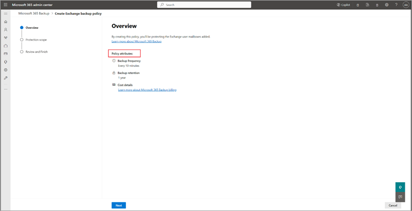

6. On the **Choose selection method** page, you can set up Exchange mailboxes using any or all three ways. A protection scope is the scope of mailboxes within Exchange that you want to protect with Microsoft 365 Backup.

    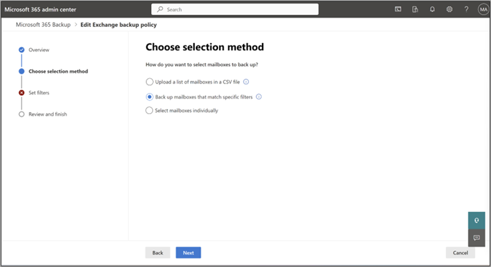

    a. Under **Upload a list of mailboxes in a CSV file**, you can upload a list of accounts to backup via a CSV file.

    The CSV upload feature for bulk addition of mailboxes in the backup policy creation workflow can accommodate a maximum of 50,000 entries per CSV file.

    b. Under **Back up mailboxes that match specific filters**, you can select **Distribution lists** or **Security groups**, or both. The distribution list and security group are flattened when added, meaning the policy won't update dynamically if the groups or distribution list are updated later.

    The rule-based feature for bulk addition of mailboxes via security groups or distribution lists can accommodate a maximum of three groups at a time. These rules are static and applied one time only. That is, the security groups or distribution lists are flattened at the time of adding to the backup configuration policy. For example. groups or list won't be dynamically updated in the system if users are added or removed from the original security group.

    > [!NOTE]
    > The site last modified feature is in preview.

    c. Under **Select mailboxes individually**, you can search and select mailboxes you want to add to a backup policy.

<!---
6. On the **Protection scope** page, choose the scope of protection for the mailbox policy. Microsoft 365 Backup for Exchange allows the addition of mailboxes in three ways.

    

    a. Under **Add via search**, select **Choose user mailboxes** to see the mailboxes that can be added via search. On the **Search and select mailboxes** panel, select the mailboxes you want to add to the policy.

    

    b. Under **Add via**, select **Distribution lists** or **Security groups**, or both. The distribution list and security group are flattened when added, meaning the policy won't update dynamically if the groups or distribution list are updated later.

    

    The rule-based feature for bulk addition of sites via site names or URL in the backup policy creation workflow can accommodate a maximum of 10 keywords at a time. Each keyword can have a minimum of three characters and maximum of 255 characters.

    The rule-based feature for bulk addition of user accounts via security groups or distribution lists can accommodate a maximum of three groups at a time. These rules are static and applied one time only. That is, the security groups or distribution lists are flattened at the time of adding to the backup configuration policy. For example. groups or list won't be dynamically updated in the system if users are added or removed from the original security group.

    > [!NOTE]
    > The site last modified feature is in preview.

    c. Under **Import from file**, select **Upload CSV** to import user account details via CSV upload.

    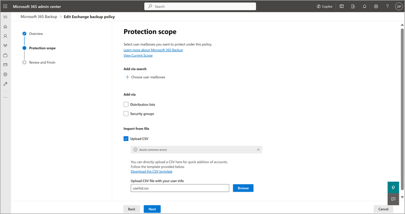

    The CSV upload feature for bulk addition of sites or user accounts in the backup policy creation workflow can accommodate a maximum of 50,000 entries per CSV file.
--->
7. Once you've made the right selections, select **Next** to create the backup policy for Exchange.

8. On the **Review Exchange backup policy** page, review the information to make sure it's how you want it, and then select **Create policy** (or **Update policy** if it's an update).

    

9. Wait for status of your policy to show as **Active** in the home screen. This might take between 15 and 60 minutes. The backup policy for Exchange is created. Select **View scope** at any time to verify the details.

    

    Once the mailboxes are added to a backup policy, it might take up to 15 minutes per 1,000 mailboxes for restore points to become available for restore.
---

## View and edit backup policies

You can edit the scope of OneDrive accounts, SharePoint sites, and Exchange mailboxes  associated with a backup policy. As part of edit, you can either add new accounts, sites, or mailboxes to or remove them from backup. Removing accounts, sites, and mailboxes from Microsoft 365 Backup doesn't mean existing backups will be deleted, rather it means additional backups will not be taken.

Select the **OneDrive**, **SharePoint**, or **Exchange** tab for steps to view and edit backup policies for that product.

# [OneDrive](#tab/onedrive)

Follow these steps to view and edit backup policies for OneDrive.

1. In the Microsoft 365 admin center, on the **Microsoft 365 Backup** page, in the **OneDrive** section, select **Edit scope**.

    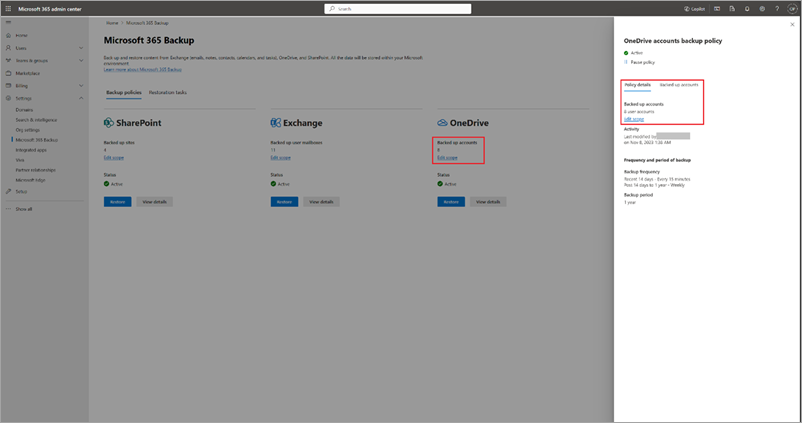

2. On the **OneDrive accounts backup policy** panel, on the **Policy details** tab, select **Edit scope**.

3. You can either add new accounts to or remove accounts from an existing OneDrive backup policy.

    a. To add new accounts, on the **Backed up accounts** tab, select **+ Add accounts**.

    b. Select the accounts from the list. Once you have added accounts to the list, follow the prompts to update the policy.

    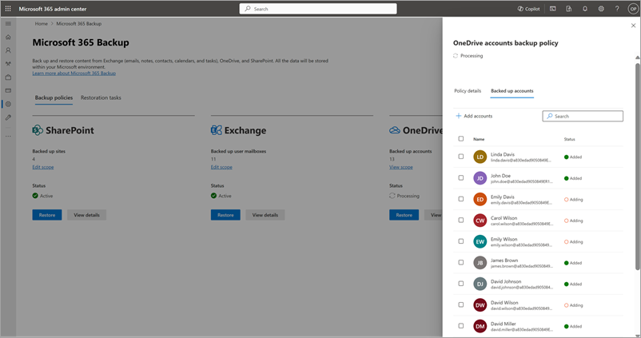

    c. To remove accounts from existing backup policy, on the **Backed up accounts** tab,  select the accounts from the list, and then select **Remove**. Once you have done your changes, follow the prompts to remove the accounts.

    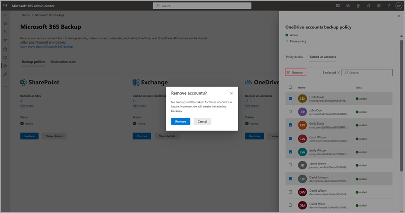

4. Once you have done your changes, follow the prompts to update the policy.

    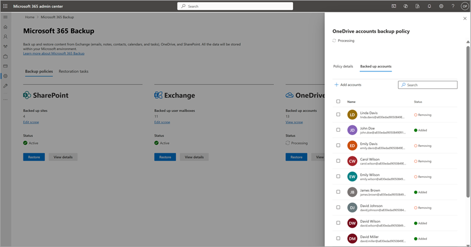

> [!NOTE]
> Removing accounts from backup policy means no future backups will be taken for those removed accounts. Existing backups for those accounts will not be deleted.

# [SharePoint](#tab/sharepoint)

Follow these steps to view and edit backup policies in SharePoint.

1. In the Microsoft 365 admin center, on the **Microsoft 365 Backup** page, in the **SharePoint** section, select **Edit scope**.

    

2. On the **SharePoint sites backup policy** panel, on the **Policy details** tab, select **Edit scope**.

3. You can either add new sites to or remove sites from an existing SharePoint backup policy.

    a. To add new sites, on the **Backed up sites** tab, select **+ Add sites**.

    b. Select sites by any method as discussed in the creation section. Once you have added sites to the list, follow the prompts to update the policy.

    

    c. To remove sites from existing SharePoint backup policy, on the **Backed up sites** tab,select the relevant sites, and then select **Remove**. Once you have done your changes, follow the prompts to remove the sites.

    

4. Once you have done your changes, follow the prompts to update the policy.

    

> [!NOTE]
> Removing sites from backup policy means no future backups will be taken for those removed sites. Existing backups for the removed sites will not be deleted.

# [Exchange](#tab/exchange)

Follow these steps to view and edit backup policies for Exchange.

1. In the Microsoft 365 admin center, on the **Microsoft 365 Backup** page, in the **Exchange** section, select **Edit scope**.

    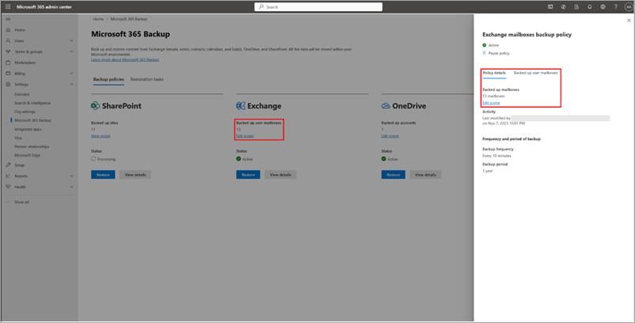

2. On the **Exchange mailbox backup policy** panel, on the **Policy details** tab, select **Edit scope**.

3. You can either add new user mailboxes to or remove user mailboxes from the existing Exchange backup policy.

    a. To add new user mailboxes, select **+ Add user mailboxes**.

    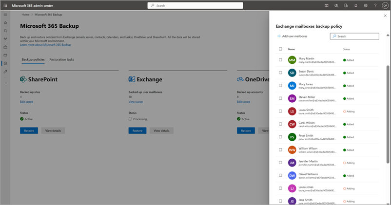

    b. To remove user mailboxes from existing backup policy, on the **Backed up sites** tab, select the user mailboxes from the list, and select **Remove**.

    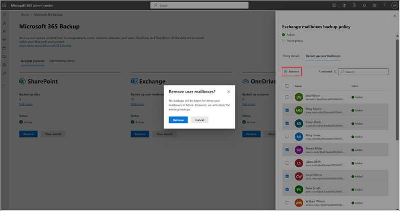

4. Once you have done your changes, follow the prompts to update the policy.

    

    > [!NOTE]
    > Removing mailboxes from backup policy means no future backups will be taken for those removed mailboxes. Existing backups for those mailboxes will not be deleted.

---