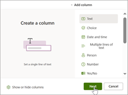

# Create autofill columns in Microsoft Syntex

Autofill is a new setting in the **Create a column** panel that lets you use natural language prompts to extract specific information or generate information from files within a SharePoint library. The information is then displayed in the columns of the library.

## Create a new autofill column

To create a new autofill column, follow these steps:

1. In a SharePoint library, select **+Add Column**, select the type of column you want, and then select **Next**.

   

2. On the **Create a column** panel, enter a name for the column heading and a brief description of the column information.

   

3. In the **Autofill** section, select **Set up**.

4. On the **Autofill** panel, in the **Prompt** box, create the prompt. The prompt identifies the type of information you want to extract from a file to a column. For some ideas about how to create a prompt for the different column types, see [Starter prompts for different column types](#starter-prompts-for-different-column-types).

   

5. In the **Test the prompt** section, select a file to test the prompt using the files in the library. You can modify the prompt and retest it until you achieve the result you want.

6. When have the prompt you want, select **Save**.

7. Once the column settings are saved, select the files in the library to which you want to apply the autofill column. Then from the ribbon, select **More options** (**\***\**) > **Autofill**.

   

    You'll see message indicating that autofill is starting to process the files and the time it might take to complete processing.

After the autofill setting on a column is saved, any new files uploaded to the library are automatically processed, and the extracted information is saved to the corresponding columns.

## Update an existing autofill column

To update an autofill, follow these steps:

1. In the document library, select the column, and then select **Column settings** > **Edit**.

2. On the **Edit column** panel, in the **Autofill** section, select **Edit prompt**.

   

3. On the **Autofill** panel, in the **Prompt** box, modify the wording as needed.

4. In the **Test the prompt** section, select a file to test the prompt using the files in the library. You can modify the prompt and retest it until you achieve the result you want.

5. When have the prompt you want, select **Save**.

## Turn off the autofill setting on a column

To turn off autofill on a specific column, follow these steps:

1. In the document library, select the column, and then select **Column settings** > **Edit**.

2. On the **Edit column** panel, in the **Autofill** section, switch the toggle to **Off**.

   

3. Select **Save**.

## Starter prompts for different column types

|Column type  |Starter prompt  |Example   |
|---------|---------|---------|
|Single line of text     | \<insert the question here>? The answer needs to be fewer than 255 characters. If no proper answer is found, respond with \<insert default response>.  | Who is the sales representative? The answer needs to be fewer than 255 characters. If no proper answer is found, respond with None.   |
|Single line of text     | \<insert the question here>? If no proper answer is found, respond with \<insert default response>. | What change is happening with the insurance network participation? If no proper answer is found, respond with None.   |
|Multiple lines of text     | \<insert the question here>? If no proper answer is found, respond with \<insert default response>.   | Who are the parties listed in the contract? If no proper answer is found, respond with None.   |
