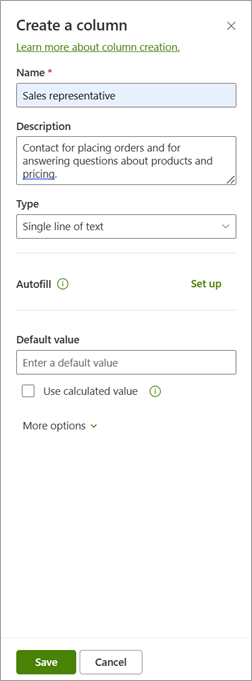

# Create autofill columns in Microsoft Syntex

Autofill columns is a new setting in the **Create a column** panel that lets you use natural language prompts to either extract specific information or generate information from files within a SharePoint library. The information is then displayed in the columns of the library.

## Create a new autofill column

To create a new autofill column, follow these steps:

1. In a SharePoint library, select **+Add Column**, select the type of column you want, and then select **Next**.

2. On the **Create a column** panel, enter a title or column heading and other information you normally would when you create a column.

   

3. In the **Autofill** section, select **Set up**.

4. On the **Autofill** panel, in the **Prompt** box, create the prompt. The prompt identifies the type of information you want to extract to a column. For some ideas about how to create a prompt for the different column types, see [Starter prompts for different column types](#starter-prompts-for-different-column-types).

   

5. In the **Test the prompt** section, select a file to test the prompt using the files in the library. You can modify the prompt and retest it until you achieve the result you want.

6. When have the prompt you want, select **Save**.

Once the column settings are saved, select the files in the library to which you want to apply the autofill column, and then select **Autofill**. You see message that indicating that autofill is starting to process the fills and the time it might take to complete processing.

Any new files uploaded to the library after the setting is saved will be automatically processed, and the extracted information will be saved to the corresponding columns.

## Update an existing autofill column

## Starter prompts for different column types

|Column type  |Starter prompt  |
|---------|---------|
|Text     | <insert the question here>. The answer needs to be less than 255 characters. If no proper answer is found, respond with <insert default response>.  <insert the question here>. If no proper answer is found, respond with <insert default response>.
  |
|Multiple lines of text     | <insert the question here>. If no proper answer is found, respond with <insert default response>.
        |
|     |         |
|    |         |
