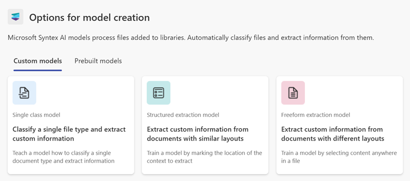
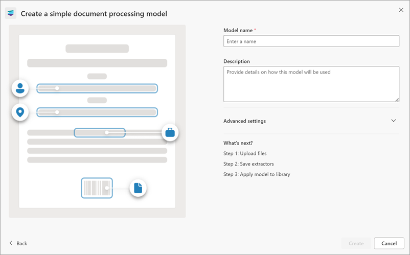

# Create an enterprise model in Microsoft Syntex

**Applies to:**  &ensp; &#10003; All custom models &ensp; | &ensp; &#10003; All prebuilt models

An enterprise model is created and trained in the [content center](create-a-content-center.md), and can be discovered by others to use. Whether you want to create a custom model or use a prebuilt model, you can do so from any of these places in Microsoft Syntex:

- From the **Models** library
- From the [content center](create-a-content-center.md) home page
- From any document library in a site where Syntex has been activated

For this article, we start in the **Models** library. For information about the different model types, see [Overview of model types in Syntex](model-types-overview.md).

If you want to create a local model, see [Create a model on a local SharePoint site](create-local-model.md).

## Create a custom model

1. From the **Models** library, select **Create a model**.
<!---
 
--->
2. On the **Options for model creation** page, select the **Custom models** tab.

    

    > [!NOTE]
    > These available model options are configured by your Microsoft 365 admin. All model options might not be available.
<!---
3. Select the type of custom model you want to create. Choose from the following prebuilt model types:

    - **Single class model** – Creates an [unstructured document processing model](document-understanding-overview.md).

    - **Freeform extraction model** – Creates a [freeform document processing model](form-processing-overview.md).

    - **Structured extraction model** – Creates a [structured document processing model](form-processing-overview.md).
--->
3. Select one of the following tabs to continue with the custom model you want to use.

# [Single class model](#tab/single-class-model)

Use the **Single class model** to create an [unstructured document processing model](document-understanding-overview.md).

1. Select **Single class model**.

2. On the **Single class model: Details** page, you'll find more information about the model. If you want to proceed with creating the model, select **Next**.

3. On the right panel of the **Create a model using a single class model** page, enter the following information.

    - **Model name** – Enter the name of the model, for example *Service agreements*.

    - **Description** – Enter information about how this model will be used.

         

4. Under **Advanced settings**:

    - In the **Content type** section, choose whether to create a new content type or to use an existing one.

    - In the **Compliance** section, select the retention label or sensitivity label you want to add. If a label has been already applied to the library where the file is stored, it will be selected.

5. When you're ready to create the model, select **Create**.

6. You're now ready to [train the model](create-a-classifier.md).

# [Freeform extraction model](#tab/freeform-extraction-model)

Use the **Freeform extraction model** to create a [freeform document processing model](form-processing-overview.md).

1. Select **Freeform extraction model**.

2. On the **Freeform extraction model: Details** page, you'll find more information about the model. If you want to proceed with creating the model, select **Next**.

3. On the right panel of the **Create a model using the freeform extraction model** page, enter the following information.

    - **Model name** – Enter the name of the model, for example *Service agreements*.

    - **Description** – Enter information about how this model will be used.

         

4. Under **Advanced settings**:

    - In the **Content type** section, choose whether to create a new content type or to use an existing one.

    - In the **Compliance** section, select the retention label or sensitivity label you want to add. If a label has been already applied to the library where the file is stored, it will be selected.

5. When you're ready to create the model, select **Create**.

6. You're now ready to [train the model](create-a-form-processing-model.md).

    > [!NOTE]
    > When published, this model type is available for reuse by others who do not own the model. Currently, this model can be edited and shared for editing only by the model owner.

# [Structured extraction model](#tab/structured-extraction-model)

Use the **Structured extraction model** to create a [structured document processing model](form-processing-overview.md).

1. Select **Structured extraction model**.

2. On the **Structured extraction model: Details** page, you'll find more information about the model. If you want to proceed with creating the model, select **Next**.

3. On the right panel of the **Create a model using the structured extraction model** page, enter the following information.

    - **Model name** – Enter the name of the model, for example *Service agreements*.

    - **Description** – Enter information about how this model will be used.

         

4. Under **Advanced settings**:

    - In the **Content type** section, choose whether to create a new content type or to use an existing one.

    - In the **Compliance** section, select the retention label or sensitivity label you want to add. If a label has been already applied to the library where the file is stored, it will be selected.

5. When you're ready to create the model, select **Create**.

6. You're now ready to [train the model](create-a-form-processing-model.md).

    > [!NOTE]
    > When published, this model type is available for reuse by others who do not own the model. Currently, this model can be edited and shared for editing only by the model owner.

---

## Create a prebuilt model

1. From the **Models** library, select **Create a model**.
<!---
 
--->
2. On the **Options for model creation** page, select the **Prebuilt models** tab.

    
<!---
3. Choose from the following prebuilt models:

- Contract processing
- Invoice processing
- Receipt processing
- Sensitive information processing
- Simple document processing
--->
3. Select one of the following tabs to continue with the prebuilt model you want to use.

# [Contract processing](#tab/contract-processing)

1. Select **Contract processing model**.

2. On the **Contract processing: Details** page, you'll find more information about the model. If you want to proceed with using the model, select **Next**.

3. On the right panel of the **Create a contract processing model** page, enter the following information.

    - **Model name** – Enter the name of the model, for example *Service agreement*.

    - **Description** – Enter information about how this model will be used.

         

4. Under **Advanced settings**:

    - In the **Content type** section, choose whether to create a new content type or to use an existing one.

    - In the **Compliance** section, select the retention label or sensitivity label you want to add. If a label has been already applied to the library where the file is stored, it will be selected.

5. When you're ready to create the model, select **Create**.

6. You're now ready to [complete setting up the model](prebuilt-model-contract.md).

# [Invoice processing](#tab/invoice-processing)

1. Select **Invoice processing model**.

2. On the **Invoice processing: Details** page, you'll find more information about the model. If you want to proceed with using the model, select **Next**.

3. On the right panel of the **Create an invoice processing model** page, enter the following information.

    - **Model name** – Enter the name of the model, for example *Office expenses*.

    - **Description** – Enter information about how this model will be used.

         

4. Under **Advanced settings**:

    - In the **Content type** section, choose whether to create a new content type or to use an existing one.

    - In the **Compliance** section, select the retention label or sensitivity label you want to add. If a label has been already applied to the library where the file is stored, it will be selected.

5. When you're ready to create the model, select **Create**.

6. You're now ready to [complete setting up the model](prebuilt-model-invoice.md).

# [Receipt processing](#tab/receipt-processing)

1. Select **Receipt processing model**.

2. On the **Receipt processing: Details** page, you'll find more information about the model. If you want to proceed with using the model, select **Next**.

3. On the right panel of the **Create a receipt processing model** page, enter the following information.

    - **Model name** – Enter the name of the model, for example *Office expenses*.

    - **Description** – Enter information about how this model will be used.

         

4. Under **Advanced settings**:

    - In the **Content type** section, choose whether to create a new content type or to use an existing one.

    - In the **Compliance** section, select the retention label or sensitivity label you want to add. If a label has been already applied to the library where the file is stored, it will be selected.

5. When you're ready to create the model, select **Create**.

6. You're now ready to [complete setting up the model](prebuilt-model-receipt.md).

# [Sensitive information processing](#tab/sensitive-information-processing)

1. Select **Sensitive information processing model**.

2. On the **Sensitive information processing: Details** page, you find information about the model and can see examples of a document library looks with entities detected and entities extracted. If you want to proceed with using the model, select **Next**.

    

3. On the **Create a sensitive information processing model** page, enter the following information.

    - **Model name** – Enter the name of the model, for example *Contact numbers*.

    - **Description** – Enter information about how this model will be used.

    

    > [!NOTE]
    > Unlike other prebuilt models, there isn't an **Advanced settings** section because the options to select a content type or to apply sensitivity or retention labels aren't available for this model. If you need a model where you must specify a content type, you'll need to use a [different model type](model-types-overview.md). The option to apply security labels will be available in a future release of this model.

4. When you're ready to create the model, select **Create**.

5. You're now ready to [complete setting up the model](prebuilt-model-sensitive-info.md#set-up-a-sensitive-information-model).

# [Simple document processing](#tab/simple-document-processing)

1. Select **Simple document processing model**.

2. On the **Simple document processing: Details** page, you'll find more information about the model. If you want to proceed with using the model, select **Next**.

3. On the **Create a simple document processing model** page, on right panel, enter the following information.

    - **Model name** – Enter the name of the model, for example *Service agreement*.

    - **Description** – Enter information about how this model will be used.

    

4. If you want to change the content type or add compliance labels, select **Advanced settings**.

    

    - In the **Content type** section, choose whether to create a new content type or to use an existing one.

    - In the **Compliance** section, select the retention label or sensitivity label you want to add. If a label has been already applied to the library where the file is stored, it will be selected.

5. When you're ready to create the model, select **Create**.

6. You're now ready to [complete setting up the model](prebuilt-model-simple.md).

---

