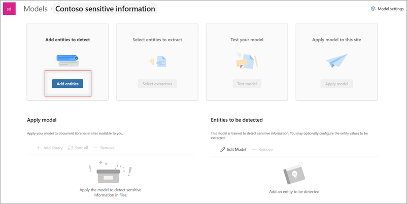
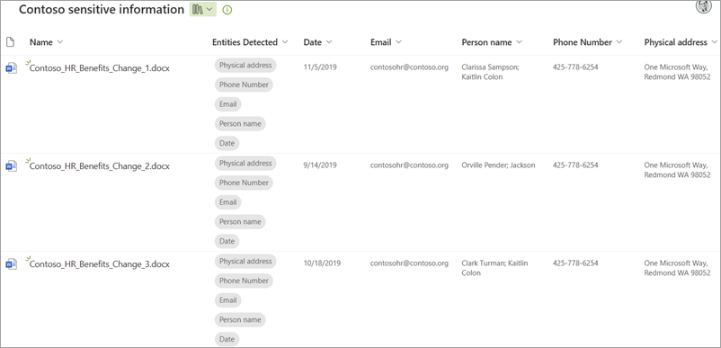

# Use a prebuilt model to detect sensitive information from documents in Microsoft Syntex

The prebuilt *sensitive information model* analyzes and detects key information from documents, and then optionally extracts the information. The model recognizes documents in various formats and [detects sensitive information](prebuilt-model-sensitive-info-entities.md) , such as personal identification numbers, physical and email addresses, phone numbers, and financial information.

<!---[detects sensitive information](/azure/ai-services/language-service/personally-identifiable-information/concepts/entity-categories)--->

## Set up a sensitive information model

To create and configure a sensitive information model, follow these steps:

1. Follow the instructions in [Create a model in Syntex](https://review.learn.microsoft.com/en-us/microsoft-365/syntex/create-syntex-model?branch=pii-prebuilt-working&tabs=layout-method%2Csensitive-information-processing#tabpanel_2_sensitive-information-processing) to create a prebuilt sensitive information model. Then continue with the following steps to complete your model.

    > [!NOTE]
    > When you create a sensitive information model, you will notice that, unlike other models, you don't have the options to select a content type or to apply sensitivity or retention labels. If you need to associate a content type, you'll need to create a different model type. The ability to apply security labels will be provided in a future release.

2. On the **Models** page, in the **Add entities to detect** section, select **Add entities**.

    

3. On the **Configure detection** page:

    - Select the language you want to use for this model. Only one language can be selected for each model.

        > [!NOTE]
        > This model supports [multiple languages](/azure/ai-services/language-service/personally-identifiable-information/language-support?tabs=documents) and provides OCR language support for both [handwritten text](/azure/ai-services/computer-vision/language-support#handwritten-text) and [printed text](/azure/ai-services/language-service/personally-identifiable-information/language-support?tabs=documents#pii-language-support).

    - From the list of supported entities, select the sensitive information entity or entities you want to detect, and then select **Next**.

    

4. On the **Configure extraction** page, you see the list of sensitive information entities you chose to detect. Select the entities you want to extract into columns, and then select **Next**.

    

5. On the **Test model** page, you test the model to make sure it detects and extracts the entities you want. Select **+Add files** to select sample files to test your model.

    

    > [!NOTE]
    > This model does not detect or extract information from encrypted files.

6. On the **Apply model** page, select **+Add library**, and choose the library you want to apply this model to, and then select **Add**.

    

7. In the document library, entities that are detected are displayed in the **Entities detected** column, and entities that are selected for extraction are displayed in their respective columns.

    

For information about file types, languages, optical character recognition, and other considerations for this model, see [Requirements and limitations for models in Microsoft Syntex](requirements-and-limitations.md#sensitive-information-processing).
<!---
## Create a rule to apply a sensitivity label

To create a rule to automatically apply a sensitivity label or a retention to a document, see [link to article TBD].--->

