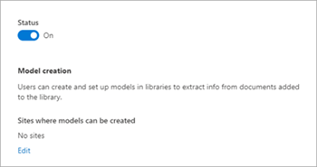

# Set up and manage prebuilt document processing in Microsoft Syntex

The prebuilt document processing service for Microsoft Syntex is set up in the Microsoft 365 admin center.

## Prerequisites

### Licensing

Before you can use prebuilt document processing in Microsoft Syntex, you must first link an Azure subscription in [Microsoft Syntex pay-as-you-go](syntex-azure-billing.md). Prebuilt document processing in Microsoft Syntex is billed based on the [type and number of transactions](syntex-pay-as-you-go-services.md).

### Permissions

You must be a [SharePoint Administrator](/entra/identity/role-based-access-control/permissions-reference#sharepoint-administrator) or [Global Administrator](/entra/identity/role-based-access-control/permissions-reference#global-administrator) to be able to access the Microsoft 365 admin center and set up prebuilt document processing.

[!INCLUDE [global-administrator-note](../includes/global-administrator-note.md)]

## Set up prebuilt document processing

After an [Azure subscription is linked to Microsoft Syntex](syntex-azure-billing.md), prebuilt document processing will be automatically set up and enabled for all SharePoint sites.

## Manage sites

By default, prebuilt document processing is turned on for libraries in all SharePoint sites. When prebuilt document processing is on, prebuilt models are allowed to run. Prebuilt models can also be created and applied on sites that are specified.

Follow these steps to limit which sites users can use create prebuilt models to process files.

1. In the Microsoft 365 admin center, select <a href="https://go.microsoft.com/fwlink/p/?linkid=2171997" target="_blank">**Setup**</a>, and then select **Use content AI with Microsoft Syntex**.

2. On the **Use content AI with Microsoft Syntex** page, select **Manage Microsoft Syntex**. 

3. On the **Manage Microsoft Syntex** page, select **Prebuilt document processing**.

4. On the **Prebuilt document processing** page:

    a. Choose which site or sites this service should be enabled for.

    > [!NOTE]
    > Disabling a site after a model is made available to process files on that site will not disable the model. Models can still be used to process files and incur charges. A model can be made available to process files by being created on that site or in a content center.

    b. To restrict user access to this service, under **Sites where models can be created**, select **Edit**. On the **Where can prebuilt models be used?** panel, select **No sites** or **Selected sites (up to 100)** and follow the instructions to either select the sites or upload a CSV file listing a maximum of 100 sites. You can then manage site access permissions for the sites you selected.

    > [!NOTE]
    > For multi-geo environments, the **No sites** and **Selected sites** settings apply only to the primary geo of multi-geo tenants. If you want to restrict or add sites in non-primary geos, contact Microsoft support.

    c. Select **Save**.

## Turn off prebuilt document processing

When the prebuilt document processing service is turned off, prebuilt models will not run, and users will not be able to create or apply prebuilt models.

Follow these steps to turn off prebuilt document processing.

1. On the **Manage Microsoft Syntex** page, select **Prebuilt document processing**.

2. On the **Prebuilt document processing** page, under **Status**, turn the toggle to **Off**.

    

    > [!NOTE]
    > For multi-geo environments, when the service is turned off, the service is off for all geos.