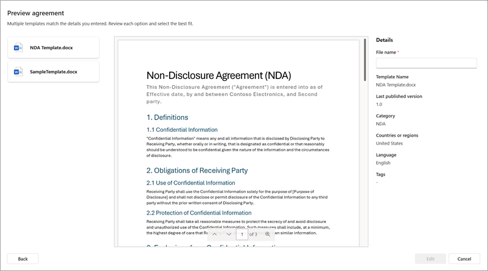
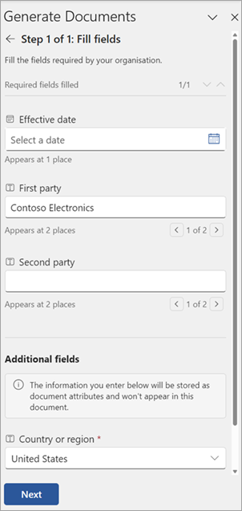

# Create an agreement in SharePoint Agreements AI

## Create an agreement from a published template

To create an agreement from a published template, follow these steps:

1. From the Agreements app in Microsoft Teams, select the **Create an agreement** card on the home tab, or select the **New Agreement** button on the **Agreements** tab.

2. On the **Create a new agreement** page, provide the required details, and then select **Find templates**.

   

3. Select **Find templates** to view list of published templates that match the information you provided. If more than one template matches the information you provided, you can preview the templates and select the template you'd like to use.

4. On the **Details** panel, provide a file name for the agreement.

   

5. Select **Edit** to generate the new agreement. The agreement opens in Microsoft Word from where you can provide values for fields and send the document for workflow.

## Create an agreement from a template in Word

To create an agreement from Microsoft Word, follow these steps:

1. Launch Microsoft Word, and then open a new blank file.

2. On the **Agreements** tab, select **Generate documents**.

3. Select **Select a template**.

4. Choose the workspace to see the available templates in the workspace.

5. Pick the template you want to generate agreements from, and then select **Use template**.

6. The template opens in a new window where you can provide values for fields and send the document for workflow.

### Fill in field values while generating an agreement

1. In Microsoft Word, on the **Generate documents** panel, select **Fill fields** to display list of fields set up in the template.

   

2. Enter the values for all fields marked as mandatory. You can also provide values for fields not marked as mandatory.

    > [!NOTE]
    > Some fields might be present in the document content, while some might not be present. These are configured in the template.

3. Select **"Next"** to review and confirm that the correct information has been entered for all the fields.

4. If there are no errors, a summary of all required fields with their values is displayed.

5. You can also modify section content if there are sections in the template marked as editable.

6. Once you're done making all changes, select **Next** to set the document to read-only mode to prevent any further edits.

## Send the agreement for workflow

Template creators have the option to configure two workflows: approval and eSignature. Any agreement generated from such a template needs to go through the workflow stages configured at the template level.

> [!NOTE]
> If the workflow is not configured with the template, you can still request approvals for documents generated from templates.

## Request approvals

1. After you fill in the fields, the next step is to send the document for approval.

2. With the agreement open in Microsoft Word, on the **Generate documents** panel, select **Request approvals**.

3. You can change the name of the request, add additional approvers as needed, and provide more details about the agreement.

4. Select **Send** to send the document for approval.

The document is set to read-only, and the document will be shared with the approver.

For documents where mandatory approvals aren't configured, follow these steps:

1. While you don't require approval for these documents, you can still choose to add approvers as needed.

2. With the agreement open in Microsoft Word, on the **Generate documents** panel, select **Request approvals**.

3. You can provide the name of the request, add approvers as needed, and provide more details about the agreement.

4. Select **Send** to send the document for approval.

The document is set as read-only, and the document will be shared with the approver.

<!---
## Request eSignature

To be provided.
--->

 

> [!div class="nextstepaction"]
> [See the complete list of help documentation.](agreements-overview.md#help-documentation)
