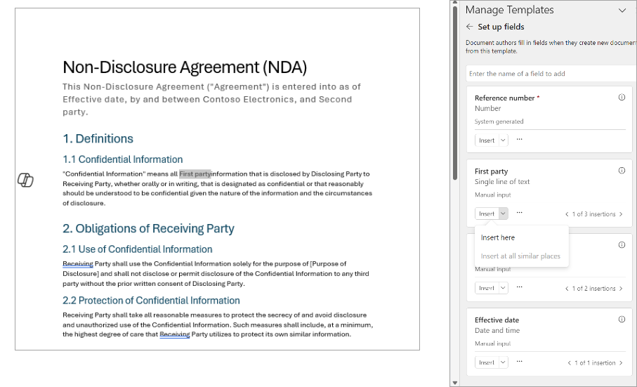
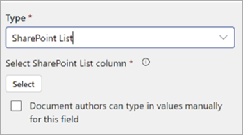
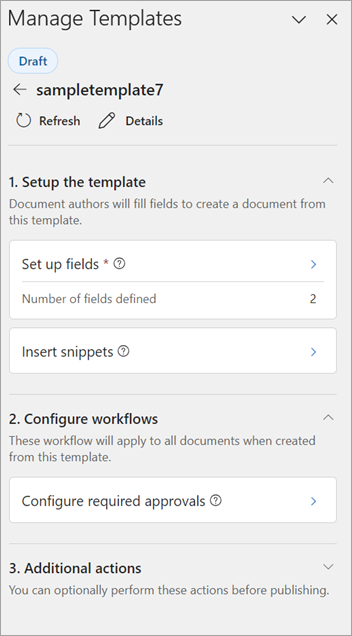
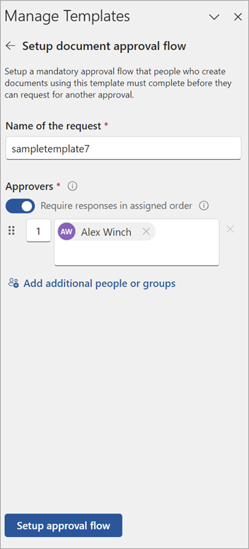
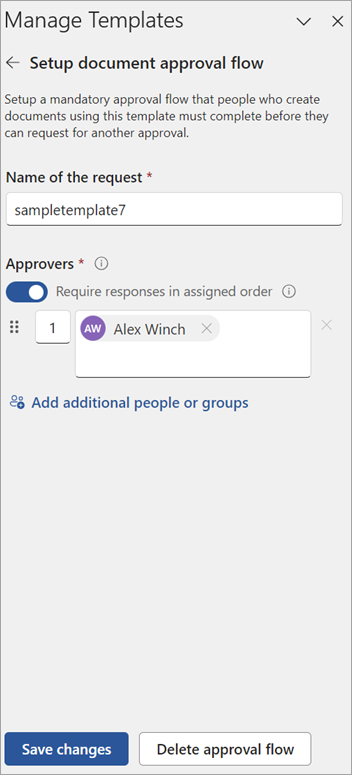

# Create a template in SharePoint Agreements AI

Templates serve as a standard format for consistently generating agreements. You can convert an existing agreement to a template or start with a blank document.

## Create a new template or use an existing agreement

To create a new template, follow these steps:

1. Go to the Agreements app in Microsoft Teams, and then select **Create a template**.

2. Optionally, you can select **Pick a file** to create a template from an existing document.

3. On the **Create a template** page, provide a name for the template, pick values for the workspace, category, country or region and language applicable to the tempalte

   

4. You can also optionally provide a description and tags.

5. Select **Open in Word** to set up fields, insert sections, configure workflows, request approvals, and publish it once it's ready.

    > [!NOTE]
    > You can't change the name of the template or the workspace where the template is stored after a draft template is created.

### Create a template in Microsoft Word

You can also create a template in Microsoft Word.

1. Go to the **Agreements** tab in Word, and then select **Manage templates**.

2. To create a new blank template, select **Create new template**.

3. If you want to convert an existing document into a template, select **Convert this document to template**.

4. Optionally, you can provide a user-friendly name and a description for the template.

5. Select the workspace where the template will be stored and the category that the template belongs to.

6. Set values for the country/region and language for the template.

7. Select **Save** to create the draft template.

8. If you started with a new template, copy or enter the content you'd like into the template file.

9. You can now set up fields, sections, and workflows for this template.

## Set up fields

Fields are areas of the template that should be filled in when generating agreements from the template. When configuring the template, you can define as many fields as you like. For example, the name of a contractor can occur multiple times in a consulting agreement document. You can create a field named "Contractor Name" and associate it with all occurrences of the name throughout the document when you generate a template.

Fields can either be added to the content of the document, or kept as additional properties for the template. You can also define if a field needs to be provided when agreements are created off the template, or if the field is optional.

There are a few standard fields that come with SharePoint Agreements AI. These include:

- **First party** – The first party on the agreement.

- **Second party** – The second party on the agreement.

- **Effective date**  –The date on which the agreement will come into effect.

- **Expiration date** – The date on which the agreement will expire.

- **Expiration type** – This can either be single date, where the agreement expires on a specific date, or evergreen, where the agreement never expires.

### Add fields to the template

1. On the **Manage templates** panel, select **Set up fields**.

   

2. Here, you can search for and reuse an existing fields or create a new one.

3. To insert the field into the content of the document, select the text from the agreement or place the cursor where you'd like to replace with the field, and select **Insert** from the field card on the **Manage templates** panel. You can also choose to insert this field at all similar instances throughout the document. You can review all field insertions in the template with the left and right arrow keys within the field card.

   

   

4. To delete the field or view more details and perform additional actions, select **More options** (**...**) on the field card.

### Create a new field

To create a new field, select **Create a new field**. When creating the field, you can provide a name for the field, mark the field as a required field, add a description, and select the type of field. Fields include the following types:

    - Single line of text
    - Multiple lines of text
    - Number
    - Date and time
    - Hyperlink
    - Email
    - Table
    - SharePoint List

### Associate a field to a list or library

You can associate fields to a SharePoint list or library. If you do so, users will be provided the list of values in the list to pick from, rather than being asked to type in the value for the fields manually.

> [!NOTE]
> If you associate fields with multiple columns of the same list or library, users can pick values for the fields that correspond to a single row in the list or library. For example, if you have a list that has the list of states and countries or regions, and you associate two fields, state and country to these columns, the value for country will be automatically picked up once the user selects the state.

To associate a field to a SharePoint list or library, follow these steps:

1. On the **Manage templates** panel, in the **Type** section, select **SharePoint List**. Then, use the **Select** button to choose a SharePoint column.

   

2. On the **Select a list** page, select the SharePoint site and the list you want to use, and then select **Next**.

   

3. On the **Select a column from the list** page, select the column name you want to associate with the field, and then select **Save**.

   

4. If you want to see the original page of lists again, select **Go to the list in SharePoint** at the bottom of the list.

5. When you're done, you see that the list field is associated with the column.

   

You can also allow users to manually input values with the **Document authors can type in values manually for this field** option. Note that the values input by the authors are only used to generate the document. They won't be added to the SharePoint list.

## Set up sections

Sections are reusable blocks of content that be used across templates. For more information, see See [Manage sections](agreements-manage-sections.md) for more details.

### Insert a section

To insert published sections into your template, follow these steps:

1. From the **Manage templates** panel, select **Insert sections**.

2. Pick the relevant section for your template from the list, and then choose **Select**.

3. Optionally, you can edit section content after it's placed in the template as needed, if the section is marked as **Editable**.

4. You can insert as many sections as you'd like. The list of sections inserted will be displayed under the **Insert sections** part.

5. You can also remove the section from the template by selecting the **Delete** option.

## Configure a workflow

Create customizable workflows that apply to all documents when created with the template.

### Configure an approval workflow for documents generated from the template

Once you create a new template or edit an existing template, you can configure an approval flow so that all documents generated from the template are sent to the approvers.

To set up a mandatory approval workflow, follow these steps:

1. On the **Manage templates** panel, in the **Configure workflows** section, select **Configure required approvals**.

   

2. Set the name of the approval request. The name can be modified by document authors when they'll be prompted to send the approval request after document authoring is completed.

3. Select **Approvers** (who needs to approve it) and decide the approval order. Once the changes are done, select **Setup approval flow**. Multiple approvers can be added to a level, and only one of them needs to approve for the request to move to next level.

   

4. Once set up, you can also choose to later modify the approval request. Once your modifications are complete, select **Save changes** to save the updated flow. You can delete the already saved approval flow by selecting **Delete approval flow**.

   

## Configure a SharePoint eSignature workflow

Once you create a new template or edit an existing one, you can configure a SharePoint eSignature flow so that all documents generated from the template must be sent for signatures as designated in the assigned flow. The SharePoint Agreements AI solution uses SharePoint eSignature to set up and send signature requests to recipients. For more information, see [Overview of SharePoint eSignature](/microsoft-365/syntex/esignature-overview).

To set up a mandatory signature workflow, follow these steps:

1. In the **Configure workflow** section, select **Configure required signatures**.

2. Set up signature fields in the template by first adding a signer label, such as first party or vendor.

3. Place your cursor where you want the signature to appear in the document, then insert the fields for signature, initials, and date.

    > [!NOTE]
    > You only need to insert the signature field locations in the template. During document generation, authors will have to assign signatory email addresses to the fields and send the PDF version of this document for signing.

4. You can add multiple instances of the same signature field across the template and then navigate through its occurrences.

5. You can create multiple signature fields for your template and add its instances in the Word document.

6. Once set up, you can also choose to later modify the signature request. Once your modifications are complete, select **Save changes** to save the updated flow. You can delete the already saved signature flow by selecting **Delete signature flow**.

## Publish the template

When you're done configuring your template, you can publish the template. Once the template state is **Published**, it becomes available for document authors to use it for document generation.

### Request approval before publishing a template

You can also request an approval on a template before publishing the template. The SharePoint Agreements AI solution uses the Approvals app in Teams to send approval requests. For more information, see [Approvals in Microsoft Teams](/power-automate/teams/native-approvals-in-teams).

To request approval before publishing the section, follow these steps:

1. From the **Agreements** tab in Word, select **Manage template**.

2. Select the template to send for approval or [create a new template](#create-a-template-in-microsoft-word).

3. Select the **Request approval before publishing** option to set up an approval flow before publishing the template.

4. Create the approval request.

5. Fill in the name of the request and the approvers (who needs to approve it). Decide approval order, add any additional information, and then select **Notify via email** if you want to send email notifications along with Teams notification.

6. After configuring the approval request, select **Send**. The template document is marked as read-only once approval request starts and those approvers who don't have access to the template will be granted view permissions.

7. Once the approval request is sent, you can track the request status (**Approval in progress** or **Approval completed**) through the Word pane by reloading the template management pane or selecting **Refresh**. You can also view the request later by selecting the **Sent** tab in the Approvals app in Teams.

8. You can cancel the sent approval request by selecting **Cancel request** or select **Edit section**, which will cancel all running flows and unlock the template for further edits, and the document will return to **Draft** state.

## Share published templates

Once a template is published, workspace owners, workspace members, and template managers can create agreements from it. You can also share the template with read-only permission to users not in the workspace. This gives those users the ability to create agreements from the template.

 

> [!div class="nextstepaction"]
> [See the complete list of help documentation.](agreements-overview.md#help-documentation)
