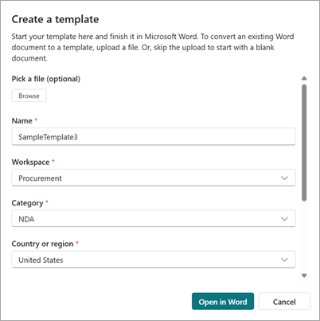
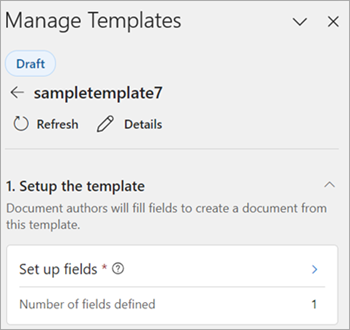
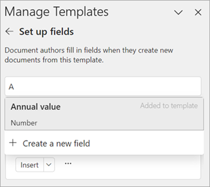
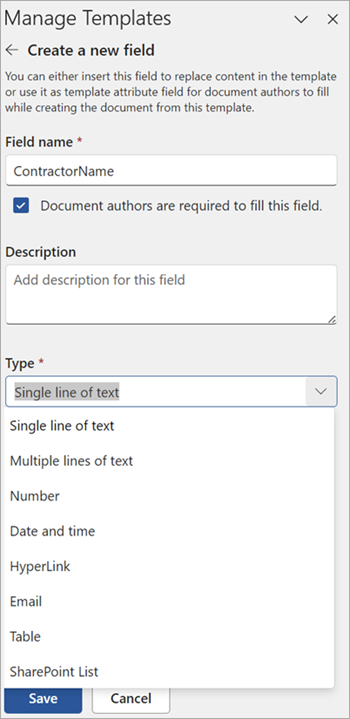
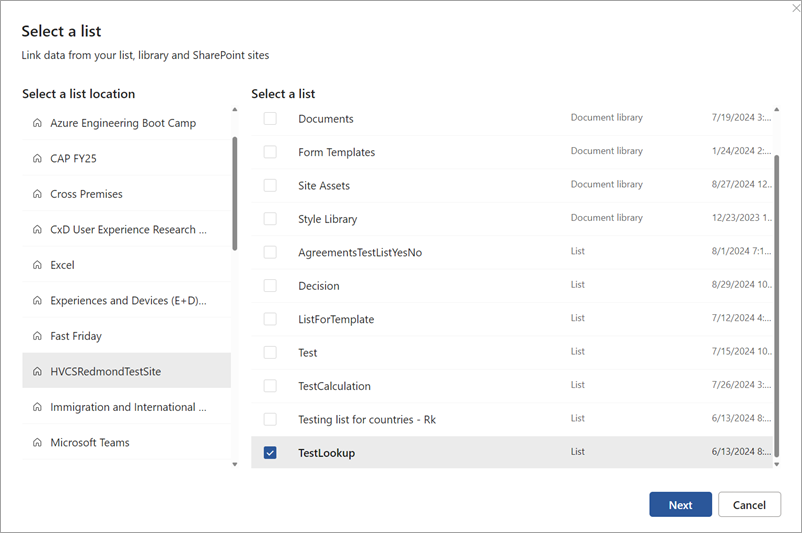
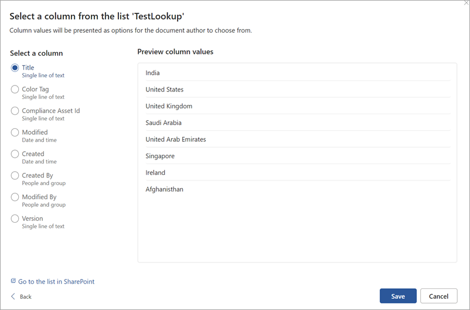
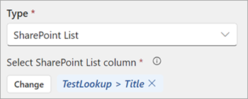

# Create a template with the SharePoint Agreements AI solution

Templates serve as a standard format for consistently generating agreements. You can convert an existing agreement to a template or start with a blank document.

## Create a new template or use an existing agreement

To create a new template, follow these steps:

1. Go to the Agreements app in Microsoft Teams, and then select **Create a template**.

2. Optionally, you can select **Pick a file** to create a template from an existing document.

3. On the **Create a template** page, provide a name for the template.

   

4. Select the workspace where the template will be stored and the category that the template belongs to.

5. Set the values for country/region and language for the template.

6. You can also optionally provide a description and tags.

7. Select **Open in Word** to set up fields, insert sections, configure workflows, request approvals, and publish it once it's ready.

    > [!NOTE]
    > You can't change the name of the template or the workspace where the template is stored after a draft template is created.

### Create a template in Microsoft Word

You can also create a template in Microsoft Word.

1. Go to the **Agreements** tab in Word, and then select **Manage templates**.

2. To create a new blank template, select **Create new template**.

3. If you want to convert an existing document into a template, select **Convert this document to template**.

4. Provide a user-friendly name and a description for the template.

5. Select the workspace where the template will be stored and the category that the template belongs to.

6. Set values for the country/region and language for the template.

7. Select **Save** to create the draft template.

## Set up fields

Once the template's draft is shown in Word on the **Manage templates** panel, you can set up new fields or use existing fields.

For example, the name of a contractor can occur multiple times in a consulting agreement document. You can create a field named "Contractor Name" and associate it with all occurrences of the name throughout the document when you generate a template.

### Create and reuse fields

1. On the **Manage templates** panel, select **Set up fields**.

   

2. Enter the name of the field in the search box. If the field name is already available, it populates the field name in the search result.

3. Now select the field name. It's displayed as a card on the **Manage templates** panel with an option to insert a field to replace content in the template.

   

   

4. If you don't find the field in the search results, you can create a new field and associate it with different data types.

5. To create a new field, select **Create a new field at** the bottom of search results.

6. On the **Manage templates** panel, select **Create a new field**.

7. You can mark the field as a required field, add a description, and select the type of field. Fields include the following types:

    - Single line of text
    - Multiple lines of text
    - Number
    - Date and time
    - Hyperlink
    - Email
    - Table
    - SharePoint list

   

## Associate a field to a list or library

To associate a field to a SharePoint list or library, follow these steps:

1. On the **Manage templates** panel, in the **Type** section, select **SharePoint List**. Then, use the **Select** button to choose a SharePoint column.

   

2. On the **Select a list** page, select the list location and the list you want to use, and then select **Next**.

   

3. On the **Select a column from the list** page, select the column name you want to associate with the field, and then select **Save**.

   

4. If you want to see the original page of lists again, select **Go to the list in SharePoint** at the bottom of the list.

5. When you're done, you see that the list field is associated with the column.

   

If you want users to be able to add inputs manually, in addition to choosing from a list, select **Document authors can type in values manually for this field**. In this case, the default for the manual input data type is single line of text. Also, the values input by the authors are only used to generate the document. They won't be added to the SharePoint list.

### Insert the field into the template

To insert the added field into the content of a template, follow these steps:

1. Select the content of the template (any text in the document) that you want to replace with a field or place the cursor at a specific location in the template where you want to insert the field.

2. To insert the field only at the specified selection, select **Insert**. To insert the field at all similar places in the document, select the down arrow icon next to the **Insert** button and select **Insert at all similar places**. This action inserts the field at all locations with text that exactly matches the selected text.

   

3. To identify or review the multiple field insertions in the template, use the left and right arrows at the bottom of the field card.

   

4. To delete the field or view more details and perform additional actions, select **More options** (**...**) on the field card.

## Insert a section

Sections are reusable blocks of content that can be inserted in a template. They can form one of the core building blocks of your templates. You can create sections once and use them across multiple templates. Once you create a new template or edit an existing template, you can choose to insert new or remove already inserted published sections.

To insert a section into the content of a template, follow these steps:

1. From the **Manage templates** panel, select **Insert sections**.

2. Choose **Select a section from library.** This takes you to the list of published sections.

3. Pick the relevant section for your template from the list, and then choose **Select**.

4. Optionally, you can edit section content after it's placed in the template as needed, if the section is marked as **Editable**.

5. You can insert as many sections as possible. The list of sections inserted will be displayed under the **Insert sections** section. You can select the relevant section, and the Word document will autoscroll to the canvas section where the section is inserted.

6. At any time, you can delete the section from the template by selecting the **Delete** option.

## Configure workflows

Create customizable workflows that apply to all documents when created with the template.

### Configure an approval workflow for documents generated from the template

Once you create a new template or edit an existing template, you can configure an approval flow so that all documents generated from the template are approved by the set of approvers before it can proceed to the next step.

To set up a mandatory approval workflow, follow these steps:

1. On the **Manage templates** panel, in the **Configure workflows** section, select **Configure required approvals**.

   

2. Set the name of the approval request. The name can be modified by document authors when they'll be prompted to send the approval request after document authoring is completed.

3. Select **Approvers** (who needs to approve it) and decide the approval order. Once the changes are done, select **Setup approval flow**. Multiple approvers can be added to a level, and only one of them needs to approve for the request to move to next level.

   

4. Once set up, you can also choose to later modify the approval request. Once your modifications are complete, select **Save changes** to save the updated flow. You can delete the already saved approval flow by selecting **Delete approval flow**.

   

## Configure a SharePoint eSignature workflow

Once you create a new template or edit an existing one, you can configure a SharePoint eSignature flow so that all documents generated from the template must be sent for signatures as designated in the assigned flow. The SharePoint Agreements AI solution uses SharePoint eSignature to set up and send signature requests to recipients. For more information, see [Overview of SharePoint eSignature](/microsoft-365/syntex/esignature-overview).

To set up a mandatory signature workflow, follow these steps:

1. In the **Configure workflow** section, select **Configure required signatures**.

2. Set up signature fields in the template by first adding a signer label, such as first party or vendor.

3. Place your cursor where you want the signature to appear in the document, then insert the fields for signature, initials, and date.

    > [!NOTE]
    > You only need to insert the signature field locations in the template. During document generation, authors will have to assign signatory email addresses to the fields and send the PDF version of this document for signing.

4. You can add multiple instances of the same signature field across the template and then navigate through its occurrences.

5. You can create multiple signature fields for your template and add its instances in the Word document.

6. Once set up, you can also choose to later modify the signature request. Once your modifications are complete, select **Save changes** to save the updated flow. You can delete the already saved signature flow by selecting **Delete signature flow**.

## Request approval before publishing a template

Once you have made the relevant changes to a template and configured for your business need, you can optionally choose to send a draft template for approval before publishing the template. The SharePoint Agreements AI solution uses the Approvals app in Teams to send approval requests. For more information, see [Approvals in Microsoft Teams](/power-automate/teams/native-approvals-in-teams).

Once the template state is **Published**, it becomes available for document authors to use it for document generation.

To request approval before publishing the section, follow these steps:

1. From the **Agreements** tab in Word, select **Manage template**.

2. Select the template to send for approval or [create a new template](#create-a-template-in-microsoft-word).

3. Select the **Request approval before publishing** option to set up an approval flow before publishing the template.

4. Create the approval request.

5. Fill in the name of the request and the approvers (who needs to approve it). Decide approval order, add any additional information, and then select **Notify via email** if you want to send email notifications along with Teams notification.

6. After configuring the approval request, select **Send**. The template document is marked as read-only once approval request starts and those approvers who don't have access to the template will be granted view permissions.

7. Once the approval request is sent, you can track the request status (**Approval in progress** or **Approval completed**) through the Word pane by reloading the template management pane or selecting **Refresh**. You can also view the request later by selecting the **Sent** tab in the Approvals app in Teams.

8. You can cancel the sent approval request by selecting **Cancel request** or select **Edit section**, which will cancel all running flows and unlock the template for further edits, and the document will return to **Draft** state.

 

> [!div class="nextstepaction"]
> [See the complete list of help documentation.](agreements-overview.md#help-documentation)