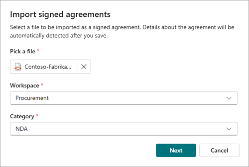

# Import an agreement in the SharePoint Agreements AI solution

You can add existing agreements by uploading signed documents. Select a file to be imported as a signed agreement. Details about the agreement will be automatically detected after you save.

To import an agreement, follow these steps:

1. From the Agreements app in Microsoft Teams, you can start an import by two ways.

    - On the **Home** tab, select the **Import** card.

   

    - On the **Agreements** tab, select the **Import** button.

   

2. Browse and pick the file that you want to import. The file must be a PDF.

   

3. Choose the workspace where the agreement should be stored, and then pick the category to which the agreement belongs.

4. Select **Next** to process the file and detect fields.

5. Once processing is complete, review the extracted values and confirm if they're correct. If a field isn't applicable, leave it blank.

    > [!NOTE]
    > These values can't be changed later.

6. Select **Save** to confirm the import. The imported agreement will be visible in the list of agreements.

    > [!NOTE]
    > It might take a few hours for the new agreement to be indexed and show up in the list of agreements.

 

> [!div class="nextstepaction"]
> [See the complete list of help documentation.](agreements-overview.md#help-documentation)
