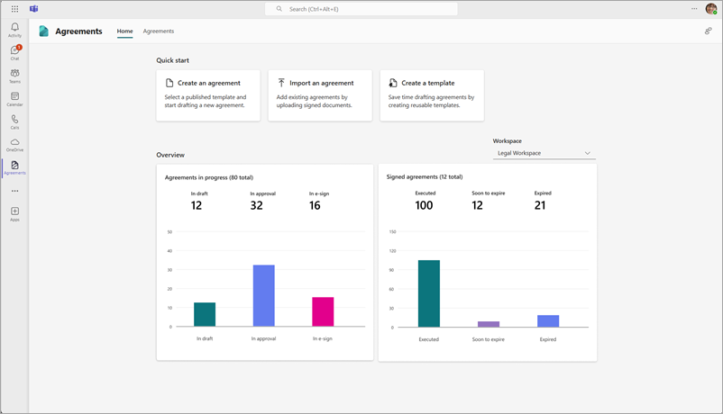

# Introduction to SharePoint Agreements

> [!NOTE]
> SharePoint Agreements is now generally available for early access customers. Contact your Microsoft representative or submit your nomination for the limited GA here: [Sign up for limited GA](https://aka.ms/AgreementsSelectiveGA). For a list of articles to help you set up and use this feature, see [Help documentation](#help-documentation).

## Overview

SharePoint Agreements is an end-to-end solution, powered by AI, to help streamline and simplify your agreements, such as nondisclosure agreements (NDAs) and statements of work (SOWs). From drafting to execution, the solution is ready to integrate seamlessly into your flow of work.

Centralize your agreements in the new Agreements app in Microsoft Teams, draft agreements with native Microsoft Word capabilities, and gain valuable AI-driven insights, making management of your agreements easier and more efficient.

## What you can do

With SharePoint Agreements, you can:

- **Centrally manage** your agreements in one place using familiar tools. SharePoint Agreements provides the [Agreements app in Microsoft Teams](https://teams.microsoft.com/l/app/fc0c5127-1a8c-4d12-9500-c142ca453b83?source=app-details-dialog) to manage all your agreements. You can view agreement lists, track their status, and receive expiring agreement reports.
  
- **Simplify your agreements process** from template to eSignature. Native capabilities in Microsoft Word allow drafting templates by adding fields. Reusable sections from the sections library can be included to ensure consistent language across all agreements. Agreements can then be generated from these templates by filling in field values and routing them for eSignature.
  
- **Gain operational efficiencies** by automatically routing agreements for approval. The approval workflow in templates can be configured by adding one or more approvers. When agreements are generated from templates, approvers receive notifications via email or Microsoft Teams.
  
- **Get AI-powered insights** infused into the flow of work. Use AI to quickly review agreements and highlight deviations from the original sections. Uploading signed agreements lets AI identify key details like the second party's name and expiration date, making them organized and searchable.

## Help documentation

|Article  |Description  |
|---------|---------|
|[Key concepts](agreements-key-concepts.md)    |Learn the key concepts in SharePoint Agreements.         |
|[Frequently asked questions](agreements-faq.md)    |Get answers to frequently asked questions about SharePoint Agreements.         |
|[Licensing requirements](agreements-license-requirements.md)    |Learn how to get and assign licenses for SharePoint Agreements.         |
|[Set up the solution](agreements-setup.md)    |Learn how to set up and manage workspaces, add the Agreements app in Microsoft Teams, and more.         |
|[Get users ready](agreements-user-prereqs.md)    |Learn how to get users ready to use all of the  solution features.         |
|[Create a template](agreements-create-template.md)    |Learn how to create and publish templates, set up fields and sections, configure workflows, and more.         |
|[Update a template](agreements-update-template.md)    |Learn how to find and edit existing templates, and publish updates to a template.         |
|[Manage sections in a template](agreements-manage-sections.md)    |Learn how to publish a new section, insert a section into a template, edit a section, and configure section settings.         |
|[Create an agreement](agreements-create-agreement.md)    |Learn how to create an agreement from a template in Microsoft Teams and in Microsoft Word.         |
|[Analyze section revisions](agreements-analyze-sections.md)    |Learn how to use the **Analyze section revisions** feature to detect changes in embedded sections, summarize the changes, and offer suggestions.       |
|[View reports](agreements-reports.md)    |Learn about the reports that are available to monitor all agreements, their statuses, and other essential metrics.         |
|[Receive approval notifications](agreements-notifications.md)    |Learn about approval notifications in the Approvals app and in email.         |
|[Import an agreement](agreements-import-agreement.md)    |Learn how to add existing agreements by uploading signed documents.        |
