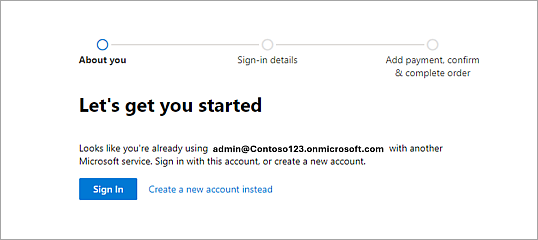
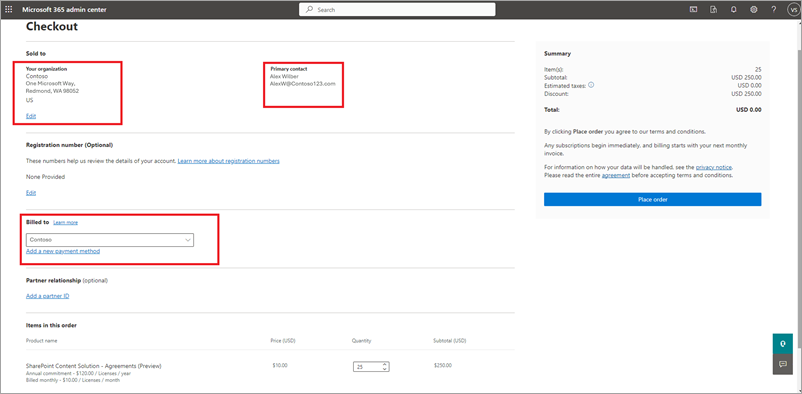
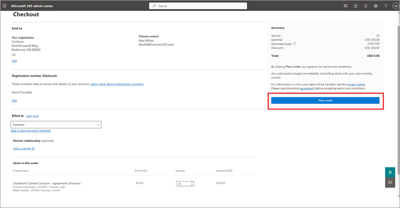
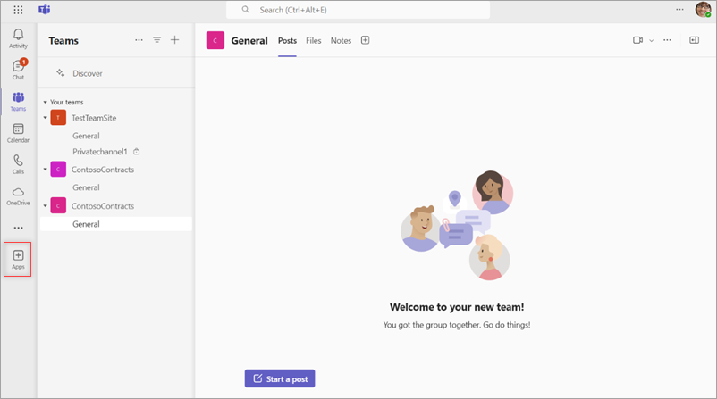

# Set up the SharePoint Agreements AI solution

<!---
## Get and assign licenses

You must be a SharePoint Administrator or Global Administrator to activate the SharePoint Agreements AI solution, purchase licenses, and assign the licenses to users.

> [!NOTE]
> While in preview, these licenses are 100% discounted for up to 25 users for six months.

### Get the licenses

1. Your Microsoft representative will provide you with a promo code link. Select the link and sign in as a Global Administrator.

   

2. On the **Checkout** page, provide your contact and billing information. This step requires a credit card, and the card won't be charged during preview.

   

3. In the **Items in this order** section, choose the number of licenses you would like. The promotional link will give you 100% discount on up to 25 licenses for six months.

    > [!IMPORTANT]
    > By default, the number of licenses is set to 1. Change this to 25 licenses to get the most out of the promo code.

   

4. In the **Summary** section, select **Place order**.

   

### Assign the licenses

Assigning licenses to users is performed the same way as assigning other licenses, such as Microsoft 365 E3 or Microsoft 365 E5.

1. Sign in to the [Microsoft 365 admin portal](https://admin.microsoft.com/) as a Global Administrator.

2. Go to **Users** > **Active users**.

3. Select the users who you would like to assign the license to. In the user information panel, go to **Licenses and apps** and assign the new **SharePoint Content Solution - Agreements (Preview)** license.

   
--->

## Set up workspaces

Workspaces are grouped areas where templates, snippets, and agreements live. Each workspace maps to a SharePoint site. Permissions are also defined at a workspace level. We recommend creating one workspace for every business line. For example, you could have one workspace each for your Legal, Procurement, and Human Resources departments.

### Prerequisites

Before setting up a workspace for SharePoint Agreements AI, you need to ensure:  

- The user implementing the steps in the article needs to be either a Global Administrator or SharePoint Administrator.

- User accounts are available with the [SharePoint Content Solution - Agreements (Preview) license](agreements-license-requirements.md#assign-license-to-a-user).

- You have downloaded and installed the latest [SharePoint Online Management Shell](https://www.microsoft.com/download/details.aspx?id=35588).

    > [!NOTE]
    > You must be a SharePoint Administrator or Global Administrator to create sites through the SharePoint Online Management Shell.

### Create a workspace

1. Launch the SharePoint Online Management Shell, and sign in as a Global Administrator or SharePoint Administrator.

2. Connect to your tenant by running the following command:

    `Connect-SPOService -Url "https://\<tenantName>-admin.sharepoint.com"`

    Replace \<tenantName> with the name of your SharePoint tenant.

   > [NOTE]
   > The Connect-SPOService might require the use of modern authentication to connect. For information about how to add modern authentication flow to your SPO-Connect cmdlet, see the [Connect-SPOService documentation](/powershell/module/sharepoint-online/connect-sposervice).

3. Run the following command to create a new SharePoint site and set it as an Agreements workspace.

    `New-SPOSite -Url "\<URL>" -Owner "\<user>" -StorageQuota 1000 -Title "<Workspace Name>" -EnableAgreementsSolution -Template "STS#3"`

    Where:

    - \<URL> is the target URL of the new site.  
    - \<User> is the email address of the owner of the new workspace.
    - \<Workspace Name> is the name you would like for the new workspace.

4. The final PowerShell steps enable approvals workflow. Run the following set of commands on the newly created SharePoint site.

     `$script = '{"$schema":"https://developer.microsoft.com/json-schemas/sp/site-design-script-actions.schema.json","actions":[{"verb":"createSPList","listName":"Modern Template Library","templateType":101,"subactions": 
      [{"verb":"enableApprovals"}]},{"verb":"createSPList","listName":"Section Library","templateType":101,"subactions":[{"verb":"enableApprovals"}]}]}'`

     `$SiteScriptResult = Add-SPOSiteScript -Title 'Enable Approvals for Template and Sections Library' -Content $script`

     `$SiteDesignResult = Add-SPOSiteDesign -Title 'Enable Approvals for Template and Sections Library' -WebTemplate STS -SiteScripts $SiteScriptResult.Id`

     `Invoke-SPOSiteDesign -Identity $SiteDesignResult.Id -WebUrl $AgreementsSiteUrl`

## Add the Agreements app in Microsoft Teams

1. Launch Microsoft Teams.

2. On the left navigation menu, select **Apps**.

   

3. Search for **Agreements**, and then select **Add**.

   

4. You'll see the Agreements app on the left navigation menu.

5. For ease of access, you can right-click **Agreements** and pin the app to the left navigation menu.

## Configure the workspace

After the workspace is created, the owner of the workspace can assign users to specific roles within the Agreements workspace and also create agreements categories.  

### Assign roles

The following roles can be assigned:

- **Workspace owner**. This role can assign additional users to roles, create and manage categories, and manage templates.

- **Workspace member**. This role can manage templates and has access to all agreements.

- **Template manager**. This role can manage templates and won't have access to all agreements by default.

- **Creator**. This role can only access their own documents and generally work with other roles to generate agreements. They might also be agreement approvers.

### Manage roles

To manage roles in a workspace:

1. As a workspace owner, launch the Agreements app in Teams.

2. Go to the **Setup & access** tab.

3. From the left navigation menu, select the **Roles** option.

4. Select the role you would like to manage.

    Here, you can add or remove users.

   

### Manage categories

To manage categories in the Agreements app:

1. As a workspace owner, launch the Agreements App in Teams.

2. Go to the **Setup & access** tab.

3. From the left navigation menu, select the **Categories** option.

   All the existing categories available in your workspace are displayed. You can rename an existing category or create new categories as needed.

   

 

> [!div class="nextstepaction"]
> [See the complete list of help documentation.](agreements-overview.md#help-documentation)
