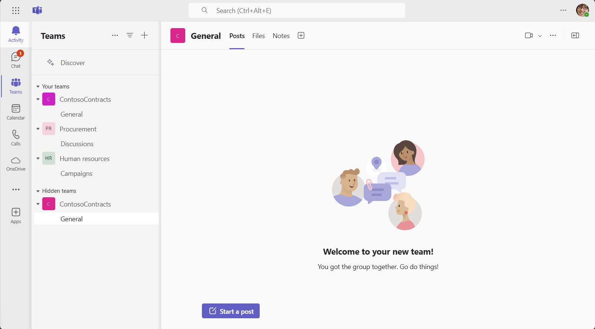

# Set up SharePoint Agreements AI

## Overview

There are a few steps to setting up the solution.

1. A Global Administrator [gets and assign the required SharePoint Content Solution - Agreements (Preview) license](agreements-license-requirements.md#assign-license-to-a-user).

2. A SharePoint Administrator [creates a workspace](#create-workspaces).

3. Workspace owners [configure their workspace](#configure-the-workspace).

4. Deploy the [Agreements app to Microsoft Teams](#add-the-agreements-app-in-microsoft-teams).

## Create workspaces

Workspaces allow you to organize and manage agreements across your organization. When you create a workspace, a SharePoint site is created and is assigned to the workspace. You can create a workspaces for business processes or departments in your organization that manages agreements. For example, you can have one workspace for your procurement team, and another one for your human resources team. Agreements, templates and other files exist within the workspace and are stored in the corresponding SharePoint site. Roles are assigned to users at a workspace level, and permissions can be managed at a workspace level. 

### Prerequisites

Before creating a workspace for SharePoint Agreements AI, you need to ensure:  

- The user implementing the steps in the article needs to be either a Global Administrator or SharePoint Administrator.

   [!INCLUDE [global-administrator-note](../../includes/global-administrator-note.md)]

- The [SharePoint Content Solution - Agreements (Preview) license](agreements-license-requirements.md#assign-license-to-a-user) is assigned to users in your organization.

- Download and install the latest [SharePoint Online Management Shell](https://www.microsoft.com/download/details.aspx?id=35588).

> [!NOTE]
> You must be a SharePoint Administrator or Global Administrator to create sites through the SharePoint Online Management Shell.

### Create a workspace

1. Launch the SharePoint Online Management Shell, and sign in as a Global Administrator or SharePoint Administrator.

2. Connect to your tenant by running the following command:

   ```Connect-SPOService -Url "https://\<tenantName>-admin.sharepoint.com"```

   Where:

   - \<tenantName> is the name of your SharePoint tenant. <br><br>

   Example: ```Connect-SPOService -Url "https://contosoelectronics-admin.sharepoint.com"```

   > [NOTE]
   > The Connect-SPOService might require the use of modern authentication to connect. For information about how to add modern authentication flow to your SPO-Connect cmdlet, see the [Connect-SPOService documentation](/powershell/module/sharepoint-online/connect-sposervice).

3. Run the following command to create a new SharePoint site and set it as an Agreements workspace.

    ```New-SPOSite -Url "\<URL>" -Owner "\<user>" -StorageQuota 1000 -Title "<Workspace Name>" -EnableAgreementsSolution -Template "STS#3"```

    Where:

    - \<URL> is the target URL of the new site.  
    - \<User> is the email address of the owner of the new workspace.
    - \<Workspace Name> is the name you would like for the new workspace.
  
    Example: ```New-SPOSite -Url "https://contosoelectronics.sharepoint.com/teams/LegalAgreements" -Owner "megan@contosoelectronics.onmicrosoft.com" -StorageQuota 1000 -Title "Legal agreements" -EnableAgreementsSolution -Template "STS#3"```

4. Run the following set of commands on the newly created SharePoint site. These steps enable the approval workflow on your site. 
   
```
     $AgreementsSiteUrl = "\<URL>"
```
Remember to replace \<URL> with the URL of the newly created SharePoint site
```
$script = '{"$schema":"https://developer.microsoft.com/json-schemas/sp/site-design-script-actions.schema.json","actions":[{"verb":"createSPList","listName":"Modern Template Library","templateType":101,"subactions":[{"verb":"enableApprovals"}]},{"verb":"createSPList","listName":"Section Library","templateType":101,"subactions":[{"verb":"enableApprovals"}]}]}

$SiteScriptResult = Add-SPOSiteScript -Title 'Enable Approvals for Template and Sections Library' -Content $script

$SiteDesignResult = Add-SPOSiteDesign -Title 'Enable Approvals for Template and Sections Library' -WebTemplate STS -SiteScripts $SiteScriptResult.Id

Invoke-SPOSiteDesign -Identity $SiteDesignResult.Id -WebUrl $AgreementsSiteUrl
```

## Deploy the Agreements app to users in Microsoft Teams

As a global administrator or a Teams administrator, you can follow [manage the Agreements app in the Microsoft Teams Admin Center](/microsoftteams/manage-apps) and deploy the app to all users or specific users in your organization.

## Add the Agreements app in Microsoft Teams

To add the Agreements app to Microsoft Teams, follow these steps (no administrator privileges needed):

1. Launch Microsoft Teams.

2. On the left navigation menu, select **Apps**.

   

3. Search for **Agreements**, and then select **Add**.

   

4. You'll see the Agreements app on the left navigation menu.

5. For ease of access, you can right-click **Agreements** and pin the app to the left navigation menu.

## Configure the workspace

Workspace owners can configure the workspace from the Agreements App. They can assign users to different roles in the workspace and manage the categories available in the workspace. 

### Manage roles

To manage roles in a workspace:

1. As a workspace owner, launch the Agreements app in Teams.

2. Go to the **Setup & access** tab.

3. From the left navigation menu, select the **Roles** option.

4. Select the role you would like to manage. You can now manage the list of users assinged to each role.
    
   

### Manage categories

To manage categories in the Agreements app:

1. As a workspace owner, launch the Agreements App in Teams.

2. Go to the **Setup & access** tab.

3. From the left navigation menu, select the **Categories** option.

   All the existing categories available in your workspace are displayed. You can rename an existing category or create new categories as needed.

   

<br>

> [!div class="nextstepaction"]
> [See the complete list of help documentation.](agreements-overview.md#help-documentation)
