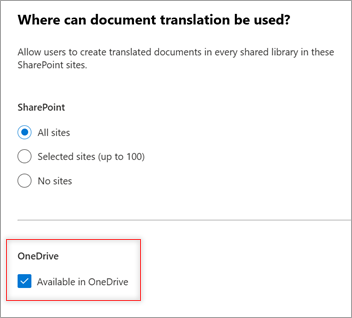

# Set up and manage document translation in Microsoft Syntex

The document translation service for Microsoft Syntex is set up in the Microsoft 365 admin center.

## Prerequisites

### Licensing

Before you can use document translation, you must first link an Azure subscription in [Syntex pay-as-you-go](syntex-azure-billing.md). Document translation is billed based on the [type and number of transactions](syntex-pay-as-you-go-services.md).

### Permissions

You must be a [SharePoint Administrator](/entra/identity/role-based-access-control/permissions-reference#sharepoint-administrator) or [Global Administrator](/entra/identity/role-based-access-control/permissions-reference#global-administrator) to be able to access the Microsoft 365 admin center and set up document translation.

[!INCLUDE [global-administrator-note](../includes/global-administrator-note.md)]

## Set up translation

After an [Azure subscription is linked to Microsoft Syntex](syntex-azure-billing.md), document translation is automatically set up and turned on for all SharePoint sites.

## Manage sites

By default, document translation is turned on for libraries in all SharePoint sites. Follow these steps to limit which sites users can use document translation.

1. In the Microsoft 365 admin center, select <a href="https://go.microsoft.com/fwlink/p/?linkid=2171997" target="_blank">**Setup**</a>.

2. Under **Billing and licenses**, select **Activate pay-as-you-go services**.

3. On the **Activate pay-as-you-go services** page, select **Get started**.

4. On the **Pay-as-you-go services** page, select the **Settings** tab, and then select **Syntex services**.

5. On the Syntex page, in the **Document & image services** section, select **Document translation**.

6. On the **Document translation** panel:

    a. Choose the site or sites on which this service should be enabled.

    b. To restrict user access to this service, under **Where document translation can be used when it's turned on**, select **Edit**. On the **Where can document translation be used?** panel, change the setting from **All sites** to **Selected sites (up to 100)** or **No sites**. For selected sites, follow the instructions to select the sites or upload a CSV listing of the sites. You can then manage site access permissions for the sites you selected.

    c. By default, document translation for OneDrive is turned on. If you want to turn it off, in the **OneDrive** section, select **Edit**. On the **Where can document translation be used?** panel, in the **OneDrive** section, clear the **Available in OneDrive** checkbox.

    

    d. Select **Save**.

## Video transcript translation

To turn on translation for video transcripts and closed captioning, see [Enable transcript translations in Stream for SharePoint](https://prod.support.services.microsoft.com/office/microsoft-syntex-pay-as-you-go-transcript-translations-in-stream-for-sharepoint-2e34ad1b-e213-47ed-a806-5cc0d88751de#bkmk_enabletranslations).