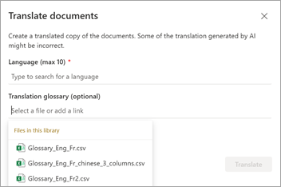
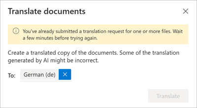

# Translate a document in Microsoft Syntex

Translation in Microsoft Syntex lets you create a translated copy of a file manually on demand or automatically by using rules. You can set a rule to create a translated copy automatically when a document is created, or when data in a column is modified.​

When a file is translated, the file name of the translated copy is appended to show the ISO code for the language.

   

## Translate a document on demand

To create a translated version of a document, follow these steps:

1. From a SharePoint document library (or from your **My files** folder in OneDrive), select the file or files you want to translate. Then use either of the following methods to start the translation process.

   - From the ribbon, select **More options** (**...**), and then select **Translate**.

       

   - Or, next to the file name in the list of documents, select **More actions** (**...**), and then select **Translate**.

       

2. On the **Translate documents** screen, under **Languages**, select the language or languages you want to use from the drop-down menu or enter them manually. You can choose up to 10 languages.

   

3. If you want to use a [custom glossary file](translation-glossary.md) for the translation, under **Translation glossary**, select the glossary file or [add a link to the file](translation-glossary.md#link-to-a-glossary-file). The option to add a glossary is only available when you are translating one language at a time.

   

4. Select **Translate**.

5. You receive a confirmation message saying that the request to translate the file has been submitted.

   

   It can take several minutes for the translated file to be created. When the process is completed, the translated file will appear in the document library.

   If you try to submit a duplicate translation request before the file has finished processing, you'll receive a message telling you to wait a few minutes before trying again.

   

## Translate a document automatically

You can create a rule to automatically translate a document [when a new file is added](content-processing-translate.md#translate-a-document-when-a-new-file-is-added) or [when data in a column changes](content-processing-translate.md#translate-a-document-when-data-in-a-column-changes). For step-by-step instruction, see [Create a rule to translate a document](content-processing-translate.md).

## Translate a video transcript

To create a translated version of a video transcript or closed captioning, see [How to translate transcripts in Stream for SharePoint](https://prod.support.services.microsoft.com/office/microsoft-syntex-pay-as-you-go-transcript-translations-in-stream-for-sharepoint-2e34ad1b-e213-47ed-a806-5cc0d88751de#bkmk_howtotranslate).