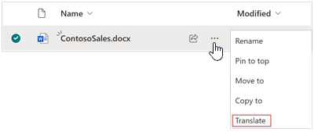
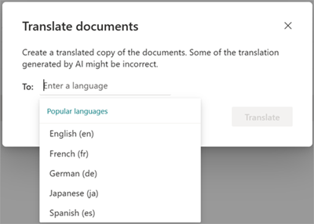
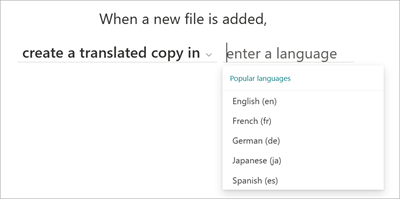
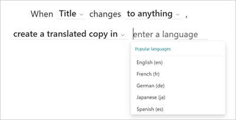

# Translate a document in Microsoft Syntex

Translation in Microsoft Syntex lets you create a translated copy of a file manually on demand or automatically by using rules. You can set a rule to create a translated copy automatically when a document is created, or when data in a column is modified.​

When a file is translated, the file name of the translated copy is appended to show the ISO code for the language.

   

## Translate a document on demand

To create a translated version of a document, follow these steps:

1. From a SharePoint document library (or from your **My files** folder in OneDrive), select the file or files you want to translate. Then use either of the following methods to start the translation process.

   - From the ribbon, select **More options** (**...**), and then select **Translate**.

       

   - Or, next to the file name in the list of documents, select **Show more actions for this item** (**...**), and then select **Translate**.

       

2. On the **Translate documents** screen, enter a language or use the drop-down menu to choose a language you want to translate the file, and then select **Translate**.

   

3. You receive a confirmation message saying that the request to translate the file has been submitted.

   

   It can take several minutes for the translated file to be created. When the process is completed, the translated file will appear in the document library.

   If you try to submit a duplicate translation request before the file has finished processing, you'll receive a message telling you to wait a few minutes before trying again.

   

## Translate a document automatically

You can create a rule to automatically translate a document [when a new file is added](content-processing-translate.md#translate-a-document-when-a-new-file-is-added) or [when data in a column changes](content-processing-translate.md#translate-a-document-when-data-in-a-column-changes). For step-by-step instruction, see [Create a rule to translate a document](content-processing-translate.md).
<!---
### When a new file is added

To create a rule to translate documents automatically when a document is created, follow these steps:

1. From a SharePoint document library, select **Automate** > **Rules** > **Create a rule**.

   

2. On the **Create a rule** page, select **A new file is added**.

   

3. Under **When a new file is added**, complete the rule statement:

    a. Select **Choose action**, and then select **create a translated copy in**.

      

    b. Select **enter a language**, and then enter a language or use the drop-down menu to choose a language into which you want to translate the file.

      

4. When your rule statement is complete, select **Create**. You can [see and manage the new rule](content-processing-overview.md#manage-a-rule) on the **Manage rules** page.

### When data in a column changes

To create a rule to translate documents automatically when data in a column changes, follow these steps:

1. From a SharePoint document library, select **Automate** > **Rules** > **Create a rule**.

   

2. On the **Create a rule** page, select **Data in a column changes**.

   

3. Under **When data in a column changes**, complete the rule statement:

    a. Select **Choose a column**, and then select the appropriate column for which to translate the file.

     

    b. Select **Choose a condition**, and then select the appropriate condition under which to translate the file.

    c. Select **Choose action**, and then select **create a translated copy in**.

    d. Select **enter a language**, and then select the language into which you want to translate the file.

     

4. When your rule statement is complete, select **Create**. You can [see and manage the new rule](content-processing-overview.md#manage-a-rule) on the **Manage rules** page.

<!---
### View the translation activity feed of a document library

When a file is translated, you'll see an update in the source library activity feed. The updates occur in both the source library and the target library.

In the document library, in the upper-right corner of the page, select the details pane icon () to view the recent history, activity, and rules that have been applied to the library.

   
--->
## Translate a video transcript

To create a translated version of a video transcript or closed captioning, see [How to translate transcripts in Stream for SharePoint](https://prod.support.services.microsoft.com/office/microsoft-syntex-pay-as-you-go-transcript-translations-in-stream-for-sharepoint-2e34ad1b-e213-47ed-a806-5cc0d88751de#bkmk_howtotranslate).